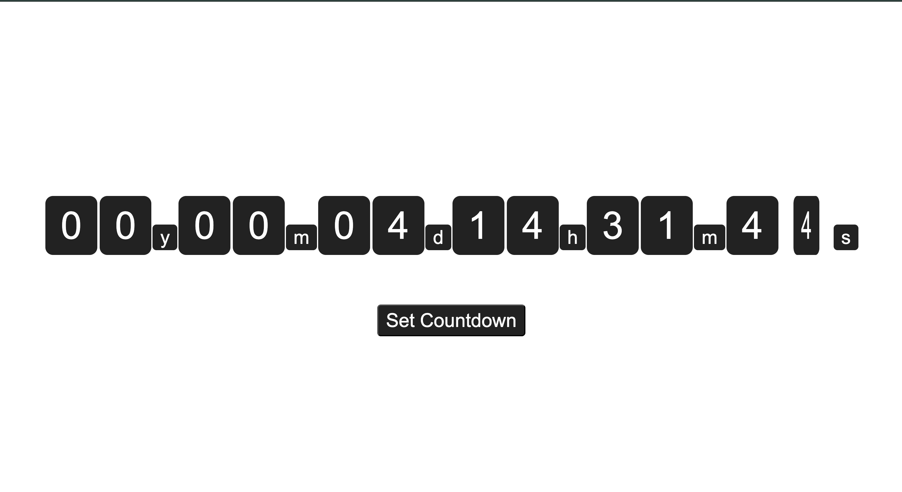

# Countdown timer

A simple countdown timer made with html, css and js, allowing you to set a date to countdown to.

Uses localstorage to store countdown date

Try the demo:

<a>https://wjchou2.github.io/CountdownTimer/index.html</a>

</img>
